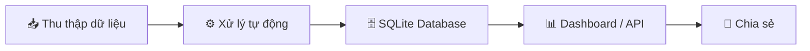

# 🚢 TDR Processor

<div align="center">


**Ứng dụng tự động xử lý, tổng hợp và trực quan hóa dữ liệu từ các file Báo cáo Khai thác Tàu (Terminal Departure Report - TDR)**

[Tính năng](#-tính-năng-nổi-bật) •
[Cài đặt](#-cài-đặt) •
[Sử dụng](#️-sử-dụng) •
[API](#-rest-api) •
[Docker](#-docker) •
[Dashboard](#-dashboard) •
[Tài liệu](#-tài-liệu)

</div>

---

## ✨ Tính năng nổi bật

| Tính năng | Mô tả |
|-----------|-------|
| 📊 **Tổng hợp tự động** | Tự động đọc và tổng hợp dữ liệu từ nhiều file TDR (`.xlsx`, `.xls`) |
| 📈 **Phân tích KPI** | Tính toán các chỉ số hiệu suất: Portstay, Gross/Net Working Time, Moves/Hour |
| ⏱️ **Thống kê Delay** | Phân loại và thống kê chi tiết thời gian dừng hoạt động |
| 🖥️ **GUI thân thiện** | Giao diện đồ họa đơn giản, dễ sử dụng (Tkinter/ttkbootstrap) |
| 🌐 **REST API** | FastAPI endpoints cho tích hợp với Power BI, Excel, hệ thống khác |
| 🗄️ **SQLite Database** | Lưu trữ dữ liệu bền vững, query nhanh, không bị corrupt |
| 🐳 **Docker Ready** | Containerized deployment với docker-compose |
| 🔌 **Plugin System** | Hỗ trợ custom extractors cho các format TDR khác nhau |
| 🔒 **Bảo mật** | Quản lý credentials an toàn qua System Keychain |
| 🧪 **Tested** | Unit tests với pytest, CI/CD qua GitHub Actions |

---

## 🔁 Quy trình làm việc



1. **Thu thập dữ liệu**: Đặt file TDR vào thư mục `data_input/`
2. **Xử lý tự động**: Ứng dụng đọc, trích xuất, làm sạch và tổng hợp dữ liệu
3. **Lưu trữ**: Kết quả được lưu vào SQLite database và CSV/Excel trong `outputs/`
4. **Trực quan hóa**: Web Dashboard (Streamlit) hoặc REST API
5. **Chia sẻ**: Xuất bản báo cáo hoặc kết nối Power BI

---

## 🚀 Cài đặt

### Yêu cầu hệ thống

- Python 3.11 trở lên
- Git (tùy chọn)

### Cài đặt thông thường

```bash
# 1. Clone repository
git clone https://github.com/your-username/tdr_processor.git
cd tdr_processor

# 2. Tạo môi trường ảo (khuyến khích)
python -m venv venv

# Windows
.\venv\Scripts\activate

# macOS/Linux
source venv/bin/activate

# 3. Cài đặt dependencies
pip install -r requirements.txt
```

### Cài đặt với Docker

```bash
# Chạy tất cả services
docker-compose up -d

# Chỉ chạy Dashboard
docker-compose up dashboard

# Chỉ chạy API
docker-compose up api
```

### Cài đặt pre-commit hooks (cho developers)

```bash
pip install pre-commit
pre-commit install
```

---

## 🏃‍♂️ Sử dụng

### Chạy ứng dụng GUI

```bash
python main.py
```

### Chạy Web Dashboard

```bash
streamlit run dashboard.py
# Mở http://localhost:8501
```

### Chạy REST API

```bash
uvicorn api:app --host 0.0.0.0 --port 8000 --reload
# Swagger UI: http://localhost:8000/docs
```

### Xử lý từ CLI

```python
from core_processor import auto_process_input_folder

# Xử lý tuần tự
result = auto_process_input_folder()

# Xử lý song song (cho batch lớn)
from core_processor import process_tdr_files_parallel
result = process_tdr_files_parallel(files, max_workers=4)
```

### Chạy từ file .exe (Người dùng cuối)

1. Chạy file `TDR_Processor.exe`
2. Nhấn nút **"📁 Select files"**
3. Chọn một hoặc nhiều file TDR (`.xlsx`, `.xls`)
4. Nhấn **"📂 Open Output folder"** để xem kết quả

---

## 🌐 REST API

API documentation tự động tại `http://localhost:8000/docs`

### Endpoints chính

| Method | Endpoint | Mô tả |
|--------|----------|-------|
| `GET` | `/health` | Health check + data summary |
| `GET` | `/api/vessels` | Danh sách vessel với filters |
| `GET` | `/api/vessels/{filename}` | Chi tiết một vessel |
| `GET` | `/api/qc-productivity` | QC productivity data |
| `GET` | `/api/delays` | Delay events |
| `GET` | `/api/delays/summary` | Tổng hợp delay theo loại |
| `GET` | `/api/containers` | Container details |
| `POST` | `/api/process` | Trigger processing |
| `GET` | `/api/process/status` | Processing status |
| `GET` | `/api/export/{table}` | Download CSV |
| `GET` | `/api/analytics/kpi` | KPI summary |
| `GET` | `/api/analytics/operators` | Operator performance |

### Ví dụ

```bash
# Lấy danh sách tàu của EVERGREEN
curl "http://localhost:8000/api/vessels?operator=EVERGREEN&limit=10"

# Trigger processing
curl -X POST "http://localhost:8000/api/process" \
  -H "Content-Type: application/json" \
  -d '{"overwrite": false, "check_duplicates": true}'

# Download CSV
curl "http://localhost:8000/api/export/vessel_summary" -o vessel_summary.csv
```

---

## 🐳 Docker

```yaml
# docker-compose.yml
services:
  dashboard:  # Streamlit - port 8501
  api:        # FastAPI - port 8000
```

```bash
# Khởi động
docker-compose up -d

# Xem logs
docker-compose logs -f dashboard

# Dừng
docker-compose down
```

**Environment variables** (tạo file `.env`):
```env
TDR_LOG_LEVEL=INFO
TDR_SMTP_SERVER=smtp.gmail.com
TDR_SMTP_PORT=587
TDR_SMTP_USER=your-email@gmail.com
TDR_SMTP_PASSWORD=your-app-password
TDR_EMAIL_ENABLED=false
```

---

## 📊 Dashboard

### Web Dashboard (Streamlit)

Mở Dashboard bằng nút **"📈 Open Web Dashboard"** trên GUI, hoặc chạy:

```bash
streamlit run dashboard.py
```

**8 Tabs phân tích:**

| Tab | Nội dung |
|-----|----------|
| 📈 Tổng quan | KPI cards, biểu đồ theo tháng/quý |
| ⚠️ Cảnh báo KPI | Danh sách tàu không đạt 45 moves/h |
| ⚙️ Năng suất khai thác | QC crane productivity analysis |
| 👨‍🔧 Năng suất vận hành | QC operator productivity |
| ⏳ Phân tích Delay | Thống kê delay theo QC, loại lỗi |
| 📦 Chi tiết Container | Bảng dữ liệu container |
| 🔍 Chất lượng dữ liệu | Completeness score, missing values |
| 📅 Timeline | Gantt chart hoạt động QC |

---

## 🔌 Plugin System

Tạo custom extractor cho các format TDR không chuẩn:

```python
# plugins/extractor_custom.py
from utils.plugin_loader import BaseExtractor

EXTRACTOR_NAME = "custom_format"
SUPPORTED_PATTERNS = ["CUSTOM_*.xlsx"]

class CustomExtractor(BaseExtractor):
    def extract_vessel_info(self) -> dict: ...
    def extract_qc_productivity(self) -> list: ...
    def extract_delay_details(self, ref_date) -> list: ...
    def extract_container_details(self) -> list: ...

EXTRACTOR_CLASS = CustomExtractor
```

Xem [`plugins/README.md`](plugins/README.md) để biết thêm chi tiết.

---

## 📁 Cấu trúc dự án

```
tdr_processor/
├── main.py               # GUI chính (Tkinter/ttkbootstrap)
├── app.py                # Streamlit simple entrypoint
├── api.py                # REST API (FastAPI)          ← NEW v3.1
├── dashboard.py          # Web Dashboard (Streamlit)
├── core_processor.py     # Logic xử lý thuần (+ parallel)
├── config.py             # Cấu hình với dataclasses
├── data_extractors.py    # Trích xuất dữ liệu từ Excel
├── data_transformers.py  # Business logic layer        ← NEW v3.1
├── data_schema.py        # Schema + Pydantic models    ← UPDATED v3.1
├── exceptions.py         # Custom exception hierarchy  ← NEW v3.1
├── report_processor.py   # Điều phối quy trình xử lý
├── requirements.txt      # Dependencies
│
├── utils/
│   ├── database.py       # SQLite layer                ← NEW v3.1
│   ├── plugin_loader.py  # Plugin system               ← NEW v3.1
│   ├── credential_manager.py  # Secure credentials
│   ├── excel_handler.py  # Đọc/ghi file Excel
│   ├── excel_utils.py    # Tiện ích Excel
│   ├── email_notifier.py # Email notifications
│   ├── file_utils.py     # File utilities
│   ├── input_validator.py # Input validation
│   ├── logger_setup.py   # Logging setup
│   ├── scheduler.py      # Task scheduler
│   └── watcher.py        # File system watcher
│
├── plugins/              # Custom extractors           ← NEW v3.1
│   └── README.md
│
├── .github/
│   └── workflows/
│       └── ci.yml        # CI/CD pipeline              ← NEW v3.1
│
├── Dockerfile            # Multi-stage Docker build    ← NEW v3.1
├── docker-compose.yml    # Service orchestration       ← NEW v3.1
├── .pre-commit-config.yaml  # Code quality hooks       ← NEW v3.1
│
├── tests/                # Unit tests
│   ├── test_data_extractors.py  # 30+ new tests        ← NEW v3.1
│   └── ...
│
├── data_input/           # Input files (TDR)
└── outputs/              # Output files (CSV, Excel, SQLite)
```

---

## 🔒 Bảo mật

TDR Processor v3.1 áp dụng các biện pháp bảo mật:

- ✅ **Credential Protection**: Lưu credentials qua System Keychain (keyring)
- ✅ **Input Validation**: Validate tất cả input từ người dùng
- ✅ **Path Traversal Prevention**: Ngăn chặn directory traversal attacks
- ✅ **File Type Validation**: Magic bytes check cho file Excel
- ✅ **Email Injection Prevention**: CRLF injection protection
- ✅ **No Hardcoded Secrets**: Tất cả credentials qua env vars

**Cấu hình Email (An toàn):**

```bash
# Windows (Command Prompt)
set TDR_SMTP_USER=your-email@gmail.com
set TDR_SMTP_PASS=your-app-password
python main.py

# Linux/macOS
export TDR_SMTP_USER="your-email@gmail.com"
export TDR_SMTP_PASS="your-app-password"
python main.py
```

> 📖 Chi tiết xem [SECURITY.md](SECURITY.md)

---

## 🧪 Testing

```bash
# Chạy tất cả tests
pytest tests/ -v

# Chạy với coverage report
pytest tests/ --cov=. --cov-report=html

# Chạy tests cụ thể
pytest tests/test_data_extractors.py -v
pytest tests/test_excel_utils.py -v
```

---

## 📦 Đóng gói (Build .exe)

```bash
# Sử dụng spec file có sẵn
pyinstaller TDR_Processor.spec

# Hoặc build thủ công
pyinstaller --onefile --windowed --name "TDR_Processor" main.py

# Output nằm trong thư mục dist/
```

> **Lưu ý:** Tạo thêm các thư mục `data_input/`, `outputs/` cạnh file `.exe` trước khi chạy.

---

## 📖 Tài liệu

| Tài liệu | Mô tả |
|----------|-------|
| [HUONG_DAN_SU_DUNG.md](HUONG_DAN_SU_DUNG.md) | Hướng dẫn sử dụng chi tiết (Tiếng Việt) |
| [ARCHITECTURE.md](ARCHITECTURE.md) | Kiến trúc hệ thống |
| [SECURITY.md](SECURITY.md) | Hướng dẫn bảo mật |
| [CONTRIBUTING.md](CONTRIBUTING.md) | Hướng dẫn đóng góp |
| [RELEASE_NOTES_v3.0.0.md](RELEASE_NOTES_v3.0.0.md) | Ghi chú phiên bản 3.0 |
| [plugins/README.md](plugins/README.md) | Hướng dẫn tạo plugin |

---

## 🗺️ Changelog

### v3.1.0 (Latest)
- ✨ **NEW**: REST API với FastAPI (`api.py`) — 12 endpoints
- ✨ **NEW**: SQLite database layer (`utils/database.py`) — thay thế Excel master files
- ✨ **NEW**: Custom exception hierarchy (`exceptions.py`) — 20+ exception types
- ✨ **NEW**: Business logic layer (`data_transformers.py`) — tách khỏi Excel I/O
- ✨ **NEW**: Plugin system (`utils/plugin_loader.py`) — custom extractors
- ✨ **NEW**: Pydantic validation models trong `data_schema.py`
- ✨ **NEW**: Parallel processing với `ThreadPoolExecutor`
- ✨ **NEW**: Docker + docker-compose deployment
- ✨ **NEW**: GitHub Actions CI/CD pipeline
- ✨ **NEW**: pre-commit hooks (Ruff, detect-secrets, mypy)
- 🐛 **FIX**: 15 bugs từ code review (debug prints, import trùng, race conditions, v.v.)
- 🔧 **IMPROVE**: Cross-platform support (`os.startfile` → `subprocess.Popen`)
- 🔧 **IMPROVE**: Unified port validation
- 🔧 **IMPROVE**: Thread-safe `ReportProcessor` với `threading.Lock`

### v3.0.0
- Refactored config với dataclasses
- Tách `core_processor.py` khỏi GUI
- Thêm `data_schema.py`
- Secure credential management

---

## 🤝 Đóng góp

Chúng tôi hoan nghênh mọi đóng góp! Xem [CONTRIBUTING.md](CONTRIBUTING.md) để biết thêm chi tiết.

```bash
# Fork repository
# Tạo branch mới
git checkout -b feature/your-feature

# Commit changes
git commit -m "feat: your feature description"

# Push và tạo Pull Request
git push origin feature/your-feature
```

---

## 📄 License

MIT License — xem [LICENSE](LICENSE) để biết thêm chi tiết.

---

<div align="center">

Developed by **Tien-Tan Thuan Port** | Version 3.1.0

</div>
