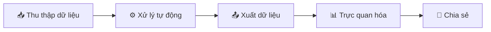

# 🚢 TDR Processor

<div align="center">


**Ứng dụng tự động xử lý, tổng hợp và trực quan hóa dữ liệu từ các file Báo cáo Khai thác Tàu (Terminal Departure Report - TDR)**

[Tính năng](#-tính-năng-nổi-bật) •
[Cài đặt](#-cài-đặt) •
[Sử dụng](#️-sử-dụng) •
[Dashboard](#-dashboard) •
[Tài liệu](#-tài-liệu)

</div>

---

## ✨ Tính năng nổi bật

| Tính năng | Mô tả |
|-----------|-------|
| 📊 **Tổng hợp tự động** | Tự động đọc và tổng hợp dữ liệu từ nhiều file TDR (định dạng `.xlsx`, `.xls`) |
| 📈 **Phân tích KPI** | Tính toán các chỉ số hiệu suất: Portstay, Gross/Net Working Time, Moves/Hour |
| ⏱️ **Thống kê Delay** | Phân loại và thống kê chi tiết thời gian dừng hoạt động theo nhiều cấp độ |
| 🖥️ **GUI thân thiện** | Giao diện đồ họa được thiết kế đơn giản, dễ sử dụng |
| 🌐 **Đa ngôn ngữ** | Hỗ trợ Tiếng Việt và Tiếng Anh |
| 📉 **Dashboard tích hợp** | Web Dashboard (Streamlit) với 8 tabs phân tích chi tiết |
| 🔒 **Bảo mật** | Quản lý credentials an toàn qua Windows Credential Manager |

---

## 🔁 Quy trình làm việc



1. **Thu thập dữ liệu**: Người dùng cung cấp các file TDR gốc
2. **Xử lý tự động**: Ứng dụng đọc, trích xuất, làm sạch và tổng hợp dữ liệu
3. **Xuất dữ liệu**: Kết quả được lưu vào thư mục `outputs/` (CSV/Excel)
4. **Trực quan hóa**: Kết nối với Power BI hoặc Web Dashboard
5. **Chia sẻ**: Xuất bản báo cáo để chia sẻ nội bộ

---

## 🚀 Cài đặt

### Yêu cầu hệ thống

- Python 3.10 trở lên
- Git (tùy chọn)

### Các bước cài đặt

```bash
# 1. Clone repository
git clone https://github.com/your-username/tdr_processor.git
cd tdr_processor

# 2. Tạo môi trường ảo (khuyến khích)
python -m venv venv

# Windows
.\venv\Scripts\activate

# macOS/Linux
source venv/bin/activate

# 3. Cài đặt dependencies
pip install -r requirements.txt
```

---

## 🏃‍♂️ Sử dụng

### Chạy ứng dụng GUI

```bash
python main.py
```

### Chạy từ file .exe (Người dùng cuối)

1. Chạy file `TDR_Processor.exe`
2. Nhấn nút **"Chọn Files TDR & Xử lý"**
3. Chọn một hoặc nhiều file TDR (`.xlsx`, `.xls`)
4. Chọn thư mục lưu kết quả
5. Nhấn **"Mở Thư Mục Kết Quả"** để xem output

---

## 📊 Dashboard

### Web Dashboard (Streamlit)

Mở Dashboard bằng nút **"📈 Open Web Dashboard"** trên GUI, hoặc chạy:

```bash
streamlit run app.py
```

**8 Tabs phân tích:**

| Tab | Nội dung |
|-----|----------|
| 📈 Tổng quan | KPI cards, biểu đồ theo tháng/quý |
| ⚠️ Cảnh báo KPI | Danh sách tàu không đạt 45 moves/h |
| ⚙️ Năng suất khai thác | QC productivity analysis |
| 👨‍🔧 Năng suất vận hành | QC operator productivity |
| ⏳ Phân tích Delay | Thống kê delay theo QC, loại |
| 📦 Chi tiết Container | Bảng dữ liệu container |
| 🔍 Chất lượng dữ liệu | Completeness score, missing values |
| 📅 Timeline | Gantt chart hoạt động QC |

---

## 📦 Đóng gói (Build .exe)

```bash
# 1. Cài đặt PyInstaller
pip install pyinstaller

# 2. Đóng gói
pyinstaller --onefile --windowed --name "TDR_Processor" main.py

# 3. Output nằm trong thư mục dist/
```

> **Lưu ý:** Tạo thêm các thư mục `data_input/`, `outputs/` cạnh file `.exe` trước khi chạy.

---

## 🔒 Bảo mật

TDR Processor v3.0 áp dụng các biện pháp bảo mật:

- ✅ **Credential Protection**: Không lưu mật khẩu vào file config
- ✅ **Input Validation**: Validate tất cả input từ người dùng
- ✅ **Path Traversal Prevention**: Ngăn chặn directory traversal attacks
- ✅ **File Type Validation**: Chỉ xử lý file Excel (.xlsx, .xls)

**Cấu hình Email (An toàn):**

```bash
# Windows (Command Prompt)
set TDR_SMTP_USER=your-email@gmail.com
set TDR_SMTP_PASS=your-app-password
python main.py

# Linux/macOS
export TDR_SMTP_USER="your-email@gmail.com"
export TDR_SMTP_PASS="your-app-password"
python main.py
```

> 📖 Chi tiết xem [SECURITY.md](SECURITY.md)

---

## 📁 Cấu trúc dự án

```
tdr_processor/
├── main.py               # GUI chính (Tkinter)
├── app.py                # Streamlit entrypoint
├── dashboard.py          # Web Dashboard (Streamlit)
├── core_processor.py     # Logic xử lý thuần
├── config.py             # File cấu hình
├── data_extractors.py    # Logic trích xuất dữ liệu
├── data_schema.py        # Schema định nghĩa
├── report_processor.py   # Điều phối quy trình xử lý
├── requirements.txt      # Dependencies
│
├── utils/                # Các module tiện ích
│   ├── excel_handler.py  # Đọc/ghi file Excel
│   ├── excel_utils.py    # Tiện ích Excel
│   ├── logger_setup.py   # Cấu hình logging
│   └── ...
│
├── templates/            # Mẫu Power BI
├── tests/                # Unit tests
├── data_input/           # Input files (TDR)
└── outputs/              # Output files (CSV, Excel)
```

---

## 📖 Tài liệu

| Tài liệu | Mô tả |
|----------|-------|
| [HUONG_DAN_SU_DUNG.md](HUONG_DAN_SU_DUNG.md) | Hướng dẫn sử dụng chi tiết (Tiếng Việt) |
| [ARCHITECTURE.md](ARCHITECTURE.md) | Kiến trúc hệ thống |
| [SECURITY.md](SECURITY.md) | Hướng dẫn bảo mật |
| [CONTRIBUTING.md](CONTRIBUTING.md) | Hướng dẫn đóng góp |
| [RELEASE_NOTES_v3.0.0.md](RELEASE_NOTES_v3.0.0.md) | Ghi chú phiên bản |

---

## 🤝 Đóng góp

Chúng tôi hoan nghênh mọi đóng góp! Xem [CONTRIBUTING.md](CONTRIBUTING.md) để biết thêm chi tiết.

```bash
# Fork repository
# Tạo branch mới
git checkout -b feature/your-feature

# Commit changes
git commit -m "Add: your feature description"

# Push và tạo Pull Request
git push origin feature/your-feature
```

---

## 📄 License

Dự án này được phát hành dưới [MIT License](LICENSE).

---

## 👨‍💻 Tác giả

**Tien - Tan Thuan Port**

© 2025-2026 TDR Processor. All rights reserved.

---

<div align="center">

**⭐ Nếu bạn thấy dự án hữu ích, hãy cho một star!**

</div>
